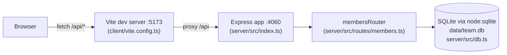

- `client/vite.config.ts` sets `root: 'client'` and proxies `/api` to `http://localhost:4060`
  — the two processes only talk over HTTP, there's no shared TS import between `client/` and
  `server/` (confirmed: no cross-directory imports in either `tsconfig.json`).
- `server/src/index.ts` mounts a single router (`membersRouter`) at `/api/members`; all
  business logic lives in that one file (`server/src/routes/members.ts`).
- `db.ts` lazily opens the SQLite connection on first `getDb()` call and seeds 8 rows if the
  table is empty — there is no separate migration step or seed script.
