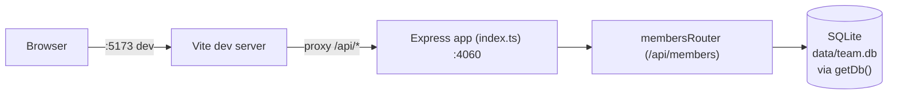

- `client/vite.config.ts` is the only thing that wires client and server together at dev time — the proxy rule (`'/api': 'http://localhost:4060'`) is what makes relative `fetch('/api/members')` calls in `App.tsx` work. There's no such wiring in production (see [[overview]]).
- `getDb()` in `server/src/db.ts` is a lazy module-level singleton: the first call opens the file (or `:memory:` if `TEAMBOARD_DB_PATH` is set), creates the table if missing, and seeds 8 rows if the table is empty. Every subsequent call returns the same `DatabaseSync` handle. Route handlers never close it.
- All five CRUD verbs plus `/export` and `/stats` live in the single `membersRouter` (`server/src/routes/members.ts`) — there's no controller/service split.
