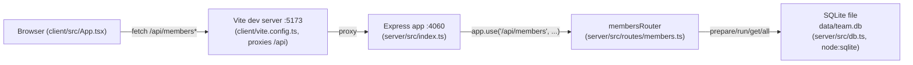

Two independently-run processes, no shared runtime: `pnpm dev` starts them concurrently (`concurrently` in `package.json`), and the client only ever talks to the server over HTTP via the Vite proxy — there's no direct import between `client/` and `server/`. The server is a single Express app with one router (`membersRouter`) mounted at `/api/members`; all persistence goes through the single `getDb()` singleton in `db.ts`, which lazily opens the SQLite file (or `:memory:` when `TEAMBOARD_DB_PATH` is set, used by tests).
