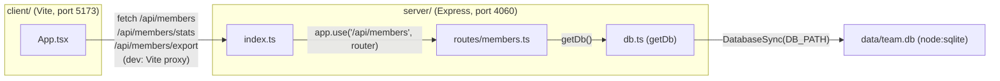

Dev-time proxy: `client/vite.config.ts` proxies `/api` to `http://localhost:4060`, so the two
processes started by `pnpm dev` (`dev:server` + `dev:client`, see `package.json`) only talk to
each other over that path — there's no shared build step or import between `client/` and
`server/`. In production (`pnpm build && pnpm start`) only the server (`dist/server/index.js`)
runs; nothing serves the client build, so `pnpm start` alone does not serve the UI.

`getDb()` is a lazy singleton (module-level `db` variable, `server/src/db.ts`) — the DB file
and schema are created on first call, not at server startup, and `DB_PATH` is fixed at first
call (env var must be set before that, see [[testing]]).
