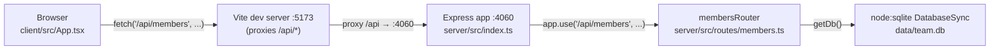

Both `client` and `server` are separate pnpm scripts run concurrently by `pnpm dev` (see ../../CLAUDE.md) — there is no shared build or shared TypeScript project reference between them; the only contract is the `/api/members*` HTTP surface. `getDb()` (`server/src/db.ts:11`) is a lazily-initialized module-level singleton shared by every route handler in the same process.
