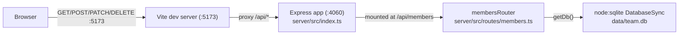

Layout and commands are already covered in [CLAUDE.md](../../CLAUDE.md) and [README.md](../../README.md) — see those for the file tree and `pnpm` scripts. This page captures the runtime shape.

- The client never talks to the server directly by absolute URL — `client/vite.config.ts` proxies `/api` to `http://localhost:4060`, and `App.tsx` fetches relative paths (`/api/members`, `/api/members/stats`). In production (`pnpm start`) there is no proxy — the compiled server (`dist/server/index.js`) is the only process, so the client build would need to be served separately or from behind the same origin.
- `getDb()` (`server/src/db.ts:11`) is a lazy module-level singleton: the first caller wins the `DB_PATH`. In tests, `TEAMBOARD_DB_PATH=':memory:'` must be set before any route handler runs — see [[testing-conventions]].
