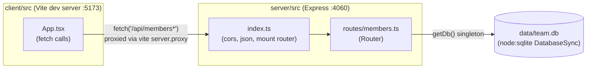

- The client never talks to the server directly in dev — `client/vite.config.ts` proxies any `/api` path from `:5173` to `http://localhost:4060`, so `pnpm dev` must run both processes (`pnpm dev` uses `concurrently` for exactly this — see `package.json`).
- There is only one router (`membersRouter`), mounted once at `/api/members`. All six endpoints (list, create, get, patch, delete, export, stats) live in the single file `server/src/routes/members.ts`.
- `getDb()` is called independently inside every route handler (no middleware injects it) — each call returns the same lazily-created singleton, so there's effectively one DB connection for the process.
