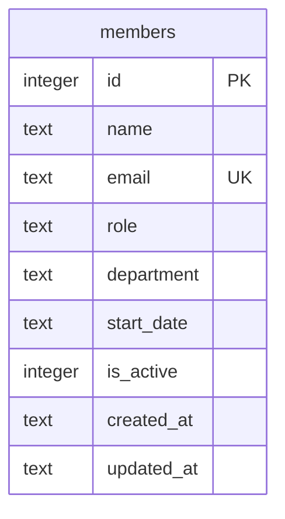

Single table, defined in `server/src/db.ts:19`. `email` has a `UNIQUE`
constraint enforced at the SQLite level, not application-level — `POST` catches
the resulting error by matching the string `'UNIQUE'` in `err.message`
(`server/src/routes/members.ts:40`) rather than a typed constraint check.

`is_active` exists but nothing in the codebase ever sets it to `0`. `GET /`
filters on `is_active = 1` (`members.ts:21`), and `DELETE /:id` hard-deletes
the row (`members.ts:115`) instead of flipping the flag — there's no soft-delete
path despite the column suggesting one. If a future change wants recoverable
deletes, `DELETE` needs to change to an `UPDATE ... SET is_active = 0`, and
`GET /:id` / `PATCH /:id` would need to decide whether they should still
return inactive rows (currently they don't filter on `is_active` at all, so a
"deleted-but-inactive" member would still be individually fetchable/editable).
