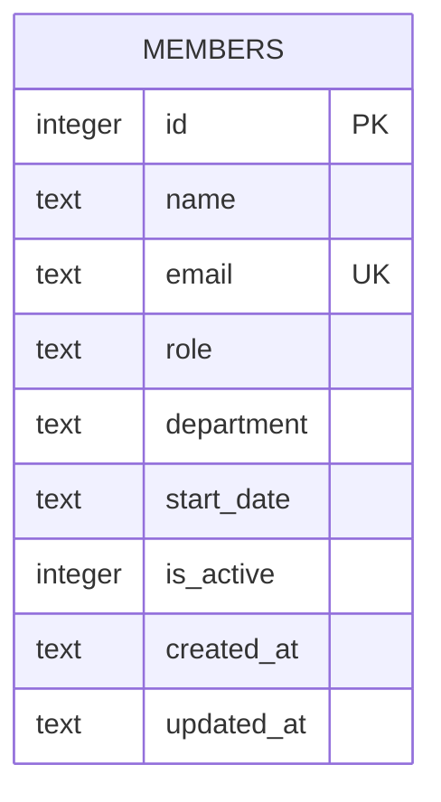

Single-table schema, created inline in `getDb()` (server/src/db.ts:18-30) —
no migrations directory, no ORM. `email` has a `UNIQUE` constraint that
`POST /api/members` surfaces as a 409 (server/src/routes/members.ts:40-43).
See ../gotchas.md for the `is_active` column's actual (non-)behavior.
