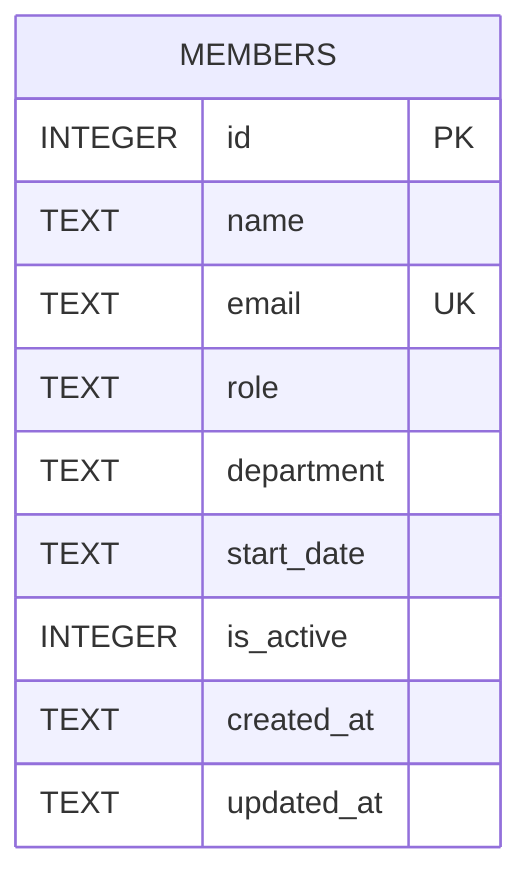

There's no Prisma/ORM/migration directory — the schema is a single inline `CREATE TABLE IF NOT EXISTS` in `getDb()` (`server/src/db.ts:18-30`).

- `email` has a `UNIQUE` constraint; `POST /api/members` catches the resulting SQLite error and maps it to `409` (`server/src/routes/members.ts:39-44`) — this is the only constraint-to-HTTP-status mapping in the codebase.
- `department` is a free-text column with **no validation or enum** anywhere in the schema or route handlers. See [[gotchas]] for why this matters (seed data already has inconsistent department names, and there's an open ticket to add validation).
- `is_active` defaults to `1` and is read by `GET /api/members` (`WHERE is_active = 1`) and `/stats`, but nothing in the codebase ever sets it to `0` — see [[gotchas]] for the hard-delete behavior.
