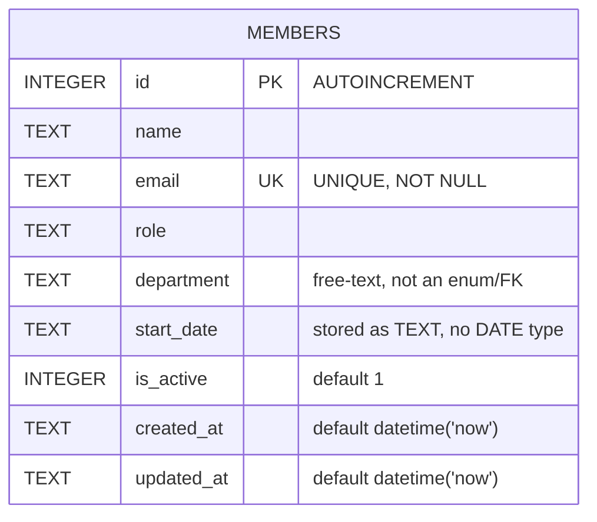

Single-table schema, created lazily by `getDb()` (`server/src/db.ts:18-30`) — no separate migration files.

## Notable gaps

- **`department` is a free-text column, not constrained to a fixed set.** The seed data itself is inconsistent — `server/src/db.ts:37` inserts `'Engineering'` for Alice Chen but `server/src/db.ts:40,44` insert `'Eng'` for David Kim and Hiro Tanaka. `GET /api/members/stats` groups by this raw string, so `'Eng'` and `'Engineering'` show up as separate departments. See [[gotchas]] for the related open validation ticket.
- **`is_active` is set once (to `1`) at insert and never updated to `0` anywhere in the codebase.** `DELETE /api/members/:id` performs a hard `DELETE FROM members`, not a soft-delete. The column exists and `GET /api/members` filters on it, but nothing in the current code path deactivates a row without deleting it.
- `email` has a `UNIQUE` constraint enforced at the DB level; `POST /api/members` catches the resulting SQLite error by string-matching `'UNIQUE'` in the message (`server/src/routes/members.ts:40`) rather than checking a SQLite error code.
