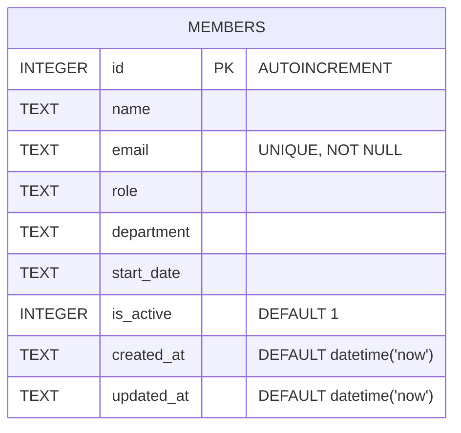

Single table, defined inline in `server/src/db.ts:18-30` (no migrations directory — schema is created with `CREATE TABLE IF NOT EXISTS` on first `getDb()` call).

## Seed data's department values are inconsistent

`server/src/db.ts:37-44` seeds 8 members. Two different strings are used for the same team: **"Engineering"** (Alice Chen) and **"Eng"** (David Kim, Hiro Tanaka). There is no enum, lookup table, or constant list of valid departments anywhere in the code — `department` is a free-text column, and `GET /api/members/stats` groups by the raw string (`server/src/routes/members.ts:65-67`), so on fresh seed data the stats page shows "Engineering" and "Eng" as two separate departments rather than one.

Anyone adding department validation (or normalizing the stats grouping) needs to either pick a canonical spelling and fix the seed data, or treat "Eng"/"Engineering" as aliases — the current code does neither.

`updated_at` is only bumped by `PATCH` (`server/src/routes/members.ts:99`); it is never touched by anything else, so a member's `created_at` and `updated_at` are identical until its first edit.
