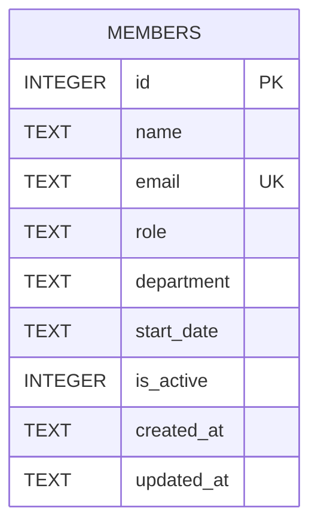

Single-table schema, created with `CREATE TABLE IF NOT EXISTS` on first `getDb()` call
(`server/src/db.ts:18-30`) — there is no migrations directory or migration tool; schema changes
mean editing this `CREATE TABLE` statement directly. `email` is the only unique constraint
(`UNIQUE`, enforced at the DB level); `members.ts:39-43` catches the resulting SQLite error by
matching the string `'UNIQUE'` in the error message to return a 409, rather than checking a
structured error code. See [[gotchas]] for the `is_active` column's actual (unused) behavior.
