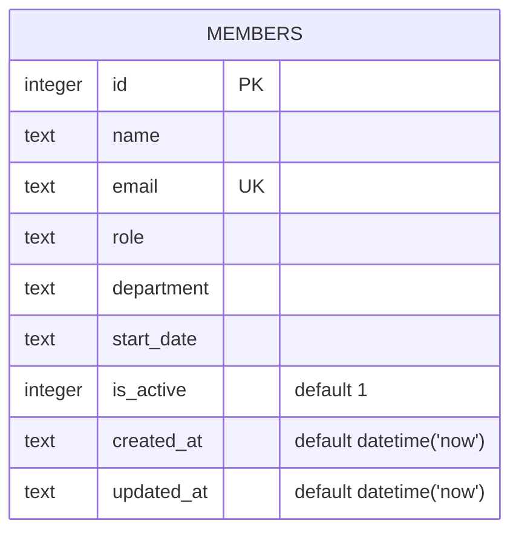

There's no migration system or `.sql` file — the schema is a single inline
`CREATE TABLE IF NOT EXISTS` in `server/src/db.ts:18-30`, run every time
`getDb()` is first called.

Just the one table — no foreign keys, no joins anywhere in the codebase.

- `email` has a `UNIQUE` constraint (`server/src/db.ts:22`); `POST /api/members` catches the resulting SQLite error by matching `err.message.includes('UNIQUE')` and returns 409 (`server/src/routes/members.ts:40-43`) — there's no pre-check query, the constraint violation *is* the validation.
- `is_active` defaults to 1 and is set once at insert time; nothing in the codebase ever writes it back to 0 (see `gotchas.md` — `DELETE` hard-deletes the row instead).
- `updated_at` is only refreshed by `PATCH` (`server/src/routes/members.ts:99`); `POST` and the seed inserts leave it at its `CREATE TABLE` default.
