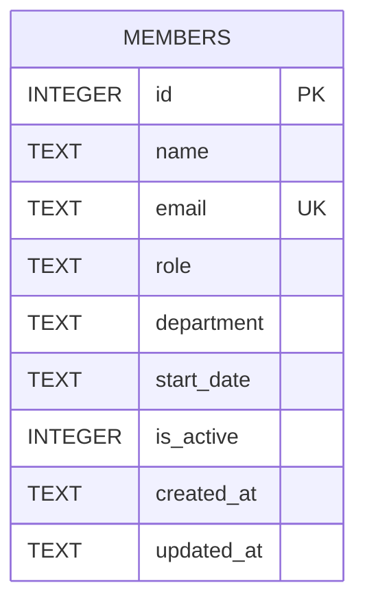

Single-table schema, defined inline in `server/src/db.ts:19-30` (no migrations directory, no ORM):

## `is_active` is not what DELETE uses

The schema and `GET /api/members` (filters `WHERE is_active = 1`, `server/src/routes/members.ts:21`) imply a soft-delete model, but `DELETE /api/members/:id` (`server/src/routes/members.ts:115`) runs `DELETE FROM members WHERE id = ?` — a hard delete. `is_active` is written once at insert time (defaults to 1) and is never flipped to 0 anywhere in the codebase. Only `GET /api/members/export` reads inactive rows (it selects all rows, no `is_active` filter). Treat `is_active` as effectively dead/unused for writes — if a task asks for "soft delete" semantics, that requires changing the DELETE handler, not just reading the column.
