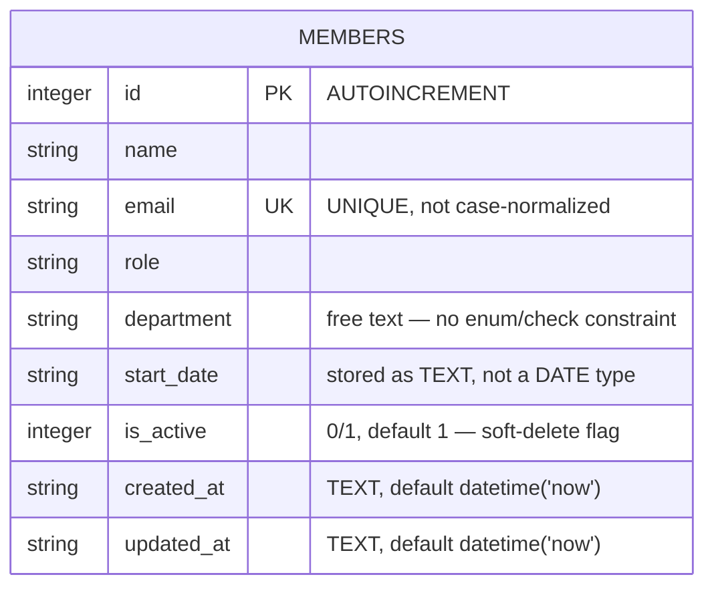

Single-table schema, created inline in `getDb()` (`server/src/db.ts:18-30`) — there is no migration system, so schema changes mean editing that `CREATE TABLE IF NOT EXISTS` string directly (existing `data/team.db` files won't pick up the change without deleting the file, since `IF NOT EXISTS` is a no-op on an already-created table).

- `department` is an unconstrained `TEXT` column — the DB layer places no restriction on values. See [[gotchas]] for the app-layer implication.
- `DELETE /api/members/:id` (`server/src/routes/members.ts:106-117`) does a real SQL `DELETE`, not a soft-delete via `is_active` — despite `is_active` existing and being used to filter `GET /api/members` and `/stats`. There's no route that flips `is_active` to 0.
