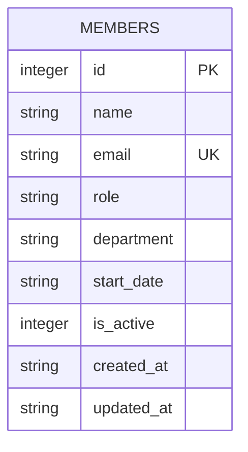

Single-table schema, created with `CREATE TABLE IF NOT EXISTS` on first `getDb()` call
(`server/src/db.ts:18-30`). No migrations mechanism — schema changes require editing this
`CREATE TABLE` statement directly (existing `data/team.db` files won't pick up column
changes automatically since `IF NOT EXISTS` is a no-op on an existing table).
