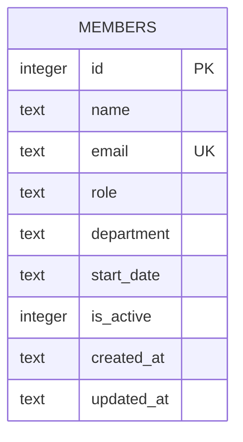

Single-table schema, created with `CREATE TABLE IF NOT EXISTS` on first
`getDb()` call — there is no migration tool; schema changes mean editing the
`db.exec(...)` DDL string in `server/src/db.ts:18-30` directly.

- `email` has a `UNIQUE` constraint; `members.ts` catches the SQLite
  `UNIQUE` error message and turns it into a 409 (`server/src/routes/members.ts:39-44`)
  rather than checking existence up front.
- `department` is a free-text column with no `CHECK` constraint or foreign
  key — see [[gotchas]] for the resulting data inconsistency and the pending
  validation work (TM-105).
- `is_active` is a soft-delete flag (`GET /` and `/stats` filter on
  `is_active = 1`), but `DELETE /:id` (`server/src/routes/members.ts:106-117`)
  does a hard `DELETE FROM members`, not a soft delete — there is no code
  path that ever sets `is_active = 0`.
