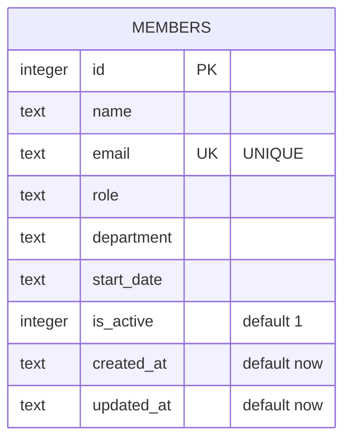

One table, no foreign keys. `email` is the only unique constraint (violating it surfaces as a SQLite `UNIQUE` error, which `POST /api/members` in `server/src/routes/members.ts` catches by string-matching `err.message.includes('UNIQUE')` and turns into a 409).

`department` and `role` are free-text columns with no enum/check constraint at the DB level — nothing in the schema restricts which department strings are valid (see `.resolver/knowledge/gotchas.md` for why that matters).
