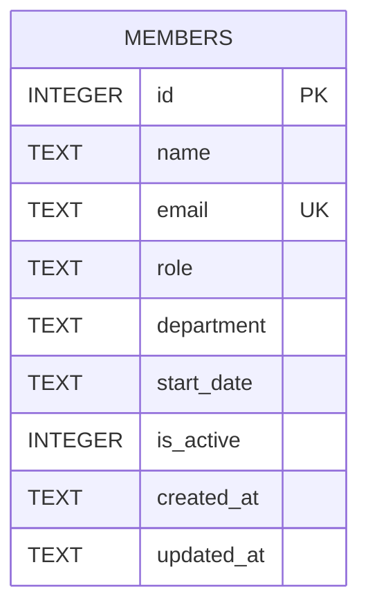

One table, created with `CREATE TABLE IF NOT EXISTS` and seeded with 8 rows
the first time `getDb()` runs against an empty database
(`server/src/db.ts:18-45`). `email` has a `UNIQUE` constraint — inserts that
violate it must be caught and turned into a 409 (see the `try/catch` in
`POST /api/members`, `server/src/routes/members.ts:33-45`, as the pattern to
follow for any new unique-constrained insert).

`department` and `role` are free-text columns with no `CHECK` constraint or
foreign key to a lookup table — see [[gotchas]] for why that matters for
`POST`/`PATCH`.
