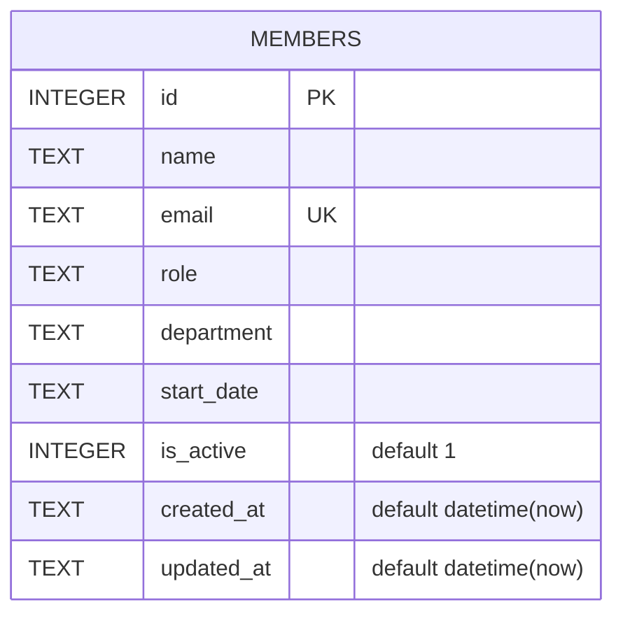

Single-table schema, created with `CREATE TABLE IF NOT EXISTS` and seeded with 8 rows only when the table is empty (`server/src/db.ts:18-45`). `email` has a `UNIQUE` constraint — `POST /api/members` relies on the resulting SQLite error (message contains `UNIQUE`) to return 409, rather than pre-checking (`server/src/routes/members.ts:39-44`).

**`is_active` is not a working soft-delete flag.** The column exists and both `GET /api/members` and `GET /api/members/stats` filter on `is_active = 1`, but no route ever sets it to `0` — `DELETE /api/members/:id` performs a real `DELETE FROM members WHERE id = ?` (`server/src/routes/members.ts:115`), and `PATCH /api/members/:id` only updates `name`/`email`/`role`/`department` (`server/src/routes/members.ts:92-101`), never `is_active` or `start_date`. If a future feature needs deactivate-without-delete, that column is already there but currently dead for that purpose.

Seed data also has inconsistent `department` values for the same team — `'Engineering'` (Alice) vs `'Eng'` (David, Hiro) — which fragments `GET /api/members/stats`' `byDepartment` grouping into separate buckets for what should be one department. See [[gotchas]] for the related open department-validation gap.
