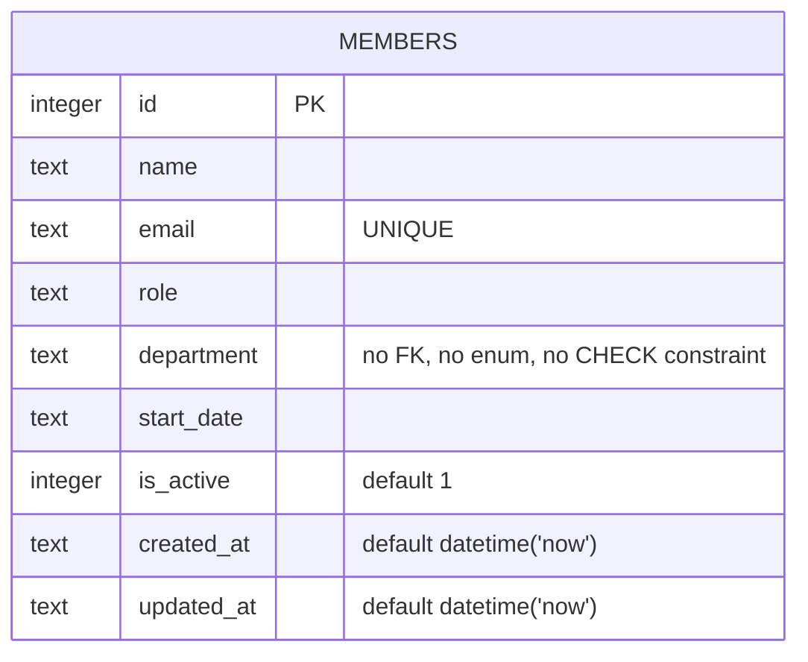

Single-table schema, created inline in `getDb()` via `CREATE TABLE IF NOT EXISTS`. There is no migrations directory or ORM — schema changes mean editing the `CREATE TABLE` statement in `server/src/db.ts` directly.

`department` is a free-text column with no whitelist, enum, or `CHECK` constraint anywhere in the schema or application code — see [[gotchas]] for why this matters right now (TM-105).
