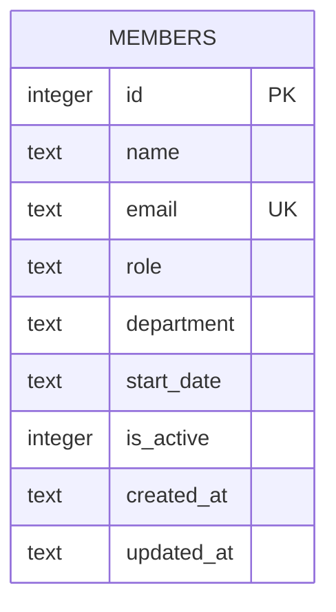

Single-table schema, created inline in `getDb()` (server/src/db.ts:18-30) — no migrations directory or ORM. `email` has a `UNIQUE` constraint enforced at insert time in `POST /api/members` (server/src/routes/members.ts:39-43, caught and returned as 409). See [[overview]] for the caveat that `is_active` is never set to 0 by any current code path.
