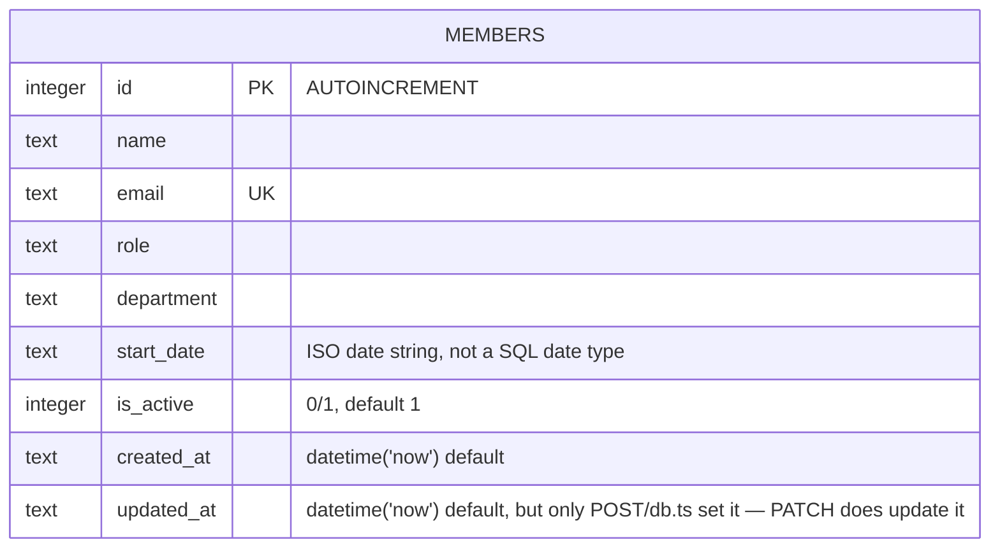

Single-table schema, created inline in `getDb()` (no migration files — the
`CREATE TABLE IF NOT EXISTS` in `db.ts` *is* the schema).

`email` is the only unique constraint; `department` is a free-text column with
no allowlist/enum at the DB level (see `gotchas.md` for the validation gap and
the inconsistent seed values this leads to).
