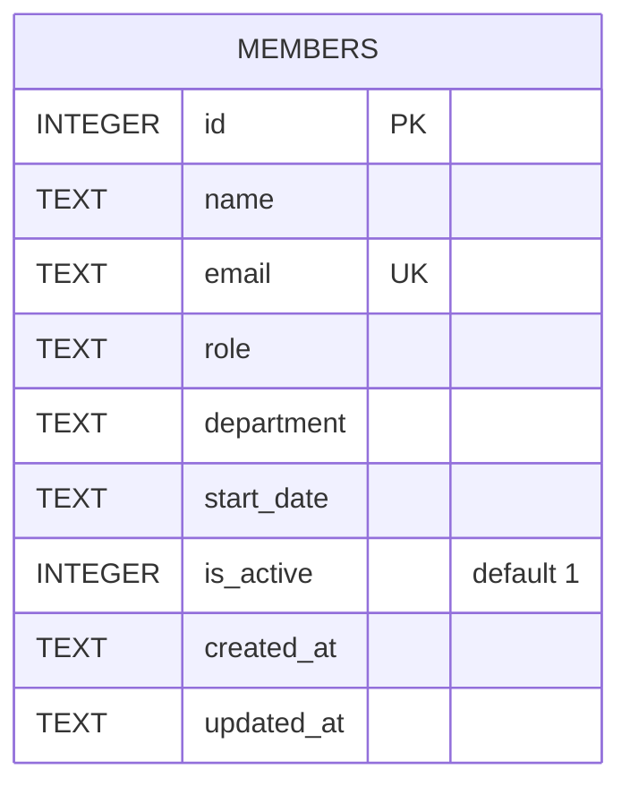

Single-table schema, created inline in `getDb()` — there is no migrations folder or ORM.

- `email` has a `UNIQUE` constraint; `POST /api/members` catches the resulting SQLite error and turns it into a `409` (server/src/routes/members.ts:39-44).
- `is_active` exists and `GET /api/members` / `GET /api/members/stats` filter on `is_active = 1`, but nothing in the codebase ever sets it to `0` — `DELETE /api/members/:id` hard-deletes the row (`DELETE FROM members WHERE id = ?`, server/src/routes/members.ts:115) instead of flagging it inactive. Treat `is_active` as effectively dead/unused rather than a working soft-delete mechanism.
- `PATCH /api/members/:id` only updates `name`, `email`, `role`, `department` (server/src/routes/members.ts:92-101) — `start_date` and `is_active` are not patchable despite existing on the row.
