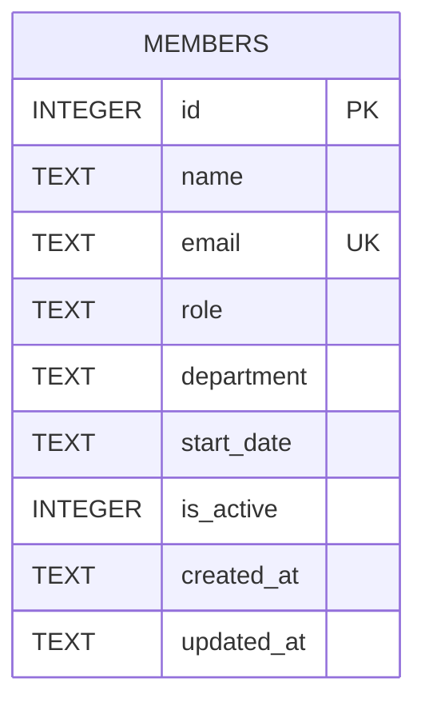

There's one table, created inline in `getDb()` (`server/src/db.ts:18-30`) — no migration files, no ORM.

Notes derived from the schema and how it's actually used in `members.ts`, not from any doc:

- `email` has a `UNIQUE` constraint; `POST /api/members` catches the resulting SQLite error and turns it into a `409` (`members.ts:39-44`). Any new insert path needs the same catch or it'll surface as an unhandled `500`.
- `department` is a free-text column with **no** foreign key, enum, or check constraint — see [[overview]] for why that's the live TM-105 gap.
- `is_active` exists and `GET /api/members` filters on it (`is_active = 1`), but nothing in the codebase ever sets it to `0`. `DELETE /api/members/:id` does a hard `DELETE FROM members` (`members.ts:115`), not a soft-delete update — so the column is currently vestigial. Don't assume a "removed" member is recoverable.
- `created_at` / `updated_at` default to `datetime('now')`; `PATCH /api/members/:id` refreshes `updated_at` but there's no trigger, so any future direct-SQL write path must set it manually.
