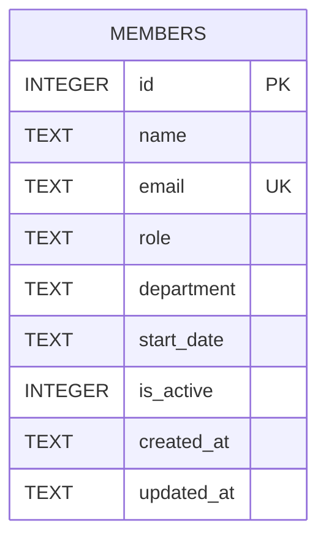

Single table, created inline in `getDb()` (`server/src/db.ts:18-30`) — there is
no migrations directory or schema file elsewhere; this function body is the
schema of record.

- `email` has a `UNIQUE` constraint; `members.ts` POST handler catches the
  resulting SQLite error by string-matching `'UNIQUE'` in the message and maps
  it to a `409`.
- `department` has **no** constraint (no enum, no FK to a departments table)
  — any string is accepted at the DB layer. See [[gotchas]] (TM-105) for why
  this matters.
- `is_active` defaults to `1` and nothing in the current code path ever sets
  it to `0`: `DELETE /api/members/:id` issues a real `DELETE FROM members`,
  not a soft-delete update. See [[gotchas]].
- Seed data (8 rows) is inserted once, only when the table is empty, in the
  same function — there's no separate seed script.
