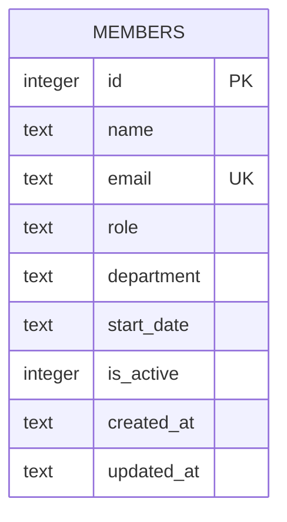

- One table, no foreign keys, no migrations framework — the schema is a single `CREATE TABLE IF NOT EXISTS` in `server/src/db.ts:18-30`, applied every time `getDb()` runs. Any schema change means editing that inline `CREATE TABLE` and it will only apply to fresh databases (existing `data/team.db` files won't get new columns — there's no `ALTER TABLE` or migration step).
- `email` has a `UNIQUE` constraint; `members.ts:40` catches the resulting SQLite error by matching the string `'UNIQUE'` in `err.message` and turns it into a 409. There's no separate pre-check query.
- `is_active` defaults to `1` and is used to filter `GET /` and `/stats`, but nothing in the codebase ever sets it to `0` — see [gotchas.md](gotchas.md) for the delete-semantics divergence this implies.
