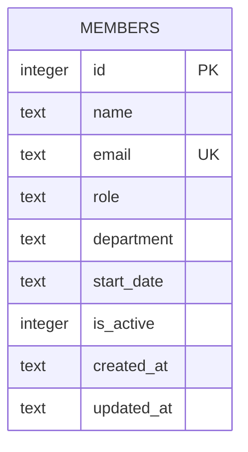

One table, no foreign keys or joins anywhere in the codebase.

- `email` is the only unique constraint; `POST /api/members` relies on the SQLite `UNIQUE`
  error to return 409 (see [[gotchas]] for the fragility of that check).
- `department` is a plain `TEXT` column with no `CHECK` constraint or enum — anything can be
  inserted today (see [[gotchas]] for why that matters).
- `is_active` is an integer flag (0/1), not a boolean column type — `node:sqlite` has no native
  boolean, so callers must treat it as `number` (see `MemberRow.is_active: number` in
  `server/src/routes/members.ts`).
