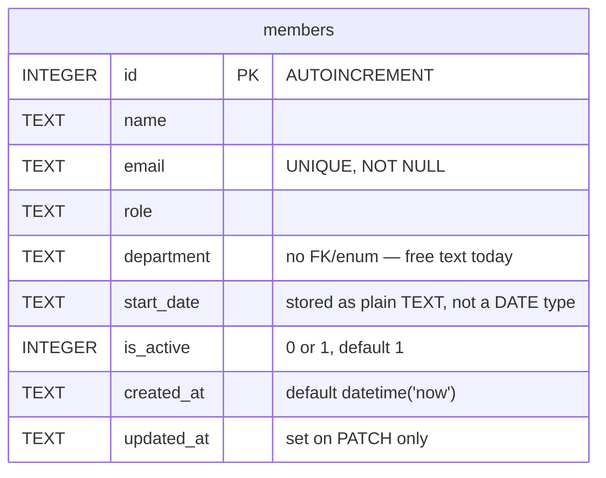

One table, created inline by `getDb()` (no migration files, no ORM):

`is_active` looks like a soft-delete flag (`GET /api/members` and `GET /api/members/stats` both filter `WHERE is_active = 1`), but nothing in the API ever writes `0` to it — `DELETE /api/members/:id` (`server/src/routes/members.ts:106`) does a real `DELETE FROM members`, not a soft-delete update. Every row that exists has `is_active = 1` in practice; the column and its read-side filters are currently dead weight rather than a working soft-delete feature.

`department` has no FK, enum, or CHECK constraint — see `../overview.md` for the related TM-105 validation gap and the inconsistent seed values (`'Engineering'` vs `'Eng'`).
