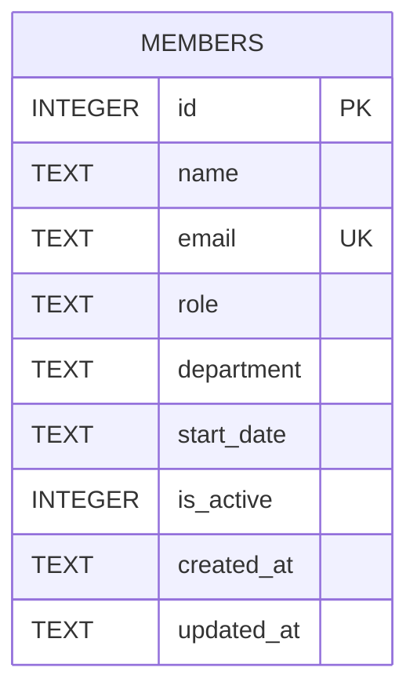

Single-table schema, created inline in `getDb()` (`server/src/db.ts:18-30`) — there's no migrations directory, this `CREATE TABLE IF NOT EXISTS` is the only source of truth.

`email` has a `UNIQUE` constraint; `POST /api/members` relies on this and catches the resulting SQLite error to return `409` instead of a raw 500 (`server/src/routes/members.ts:39-43`).

`department` is a free-text `TEXT` column with no `CHECK` constraint or foreign key to a lookup table — see [[gotchas]] for the seed-data fallout of that and the pending TM-105 validation work.

`is_active` defaults to `1` and is read by `GET /api/members` and `GET /api/members/stats` to filter to active members, but nothing in the codebase ever writes `is_active = 0` — see [[gotchas]] for why `DELETE` doesn't use it.
