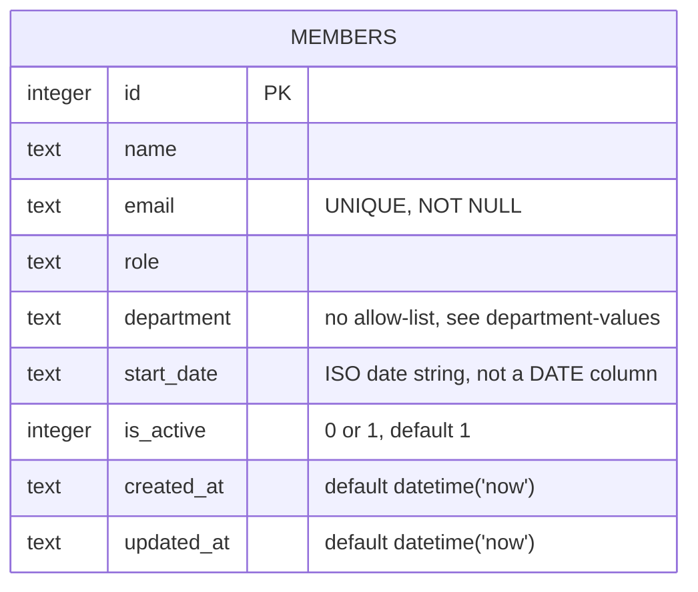

Single table, created lazily by `getDb()` in `server/src/db.ts` via `CREATE TABLE IF NOT
EXISTS`. There are no other tables, no foreign keys, and no migrations directory — schema
changes mean editing the `CREATE TABLE` string directly (existing rows in a dev `data/team.db`
won't pick up new columns automatically; `IF NOT EXISTS` is a no-op if the table already
exists).

`is_active` is a soft-delete flag in name, but `router.delete('/:id', ...)` in
`server/src/routes/members.ts` issues a real `DELETE FROM members WHERE id = ?` — it does not
set `is_active = 0`. So despite the column existing and `GET /api/members` filtering on
`is_active = 1`, nothing in the current code ever sets `is_active` to `0`; it stays `1` for
every row until the row is hard-deleted. `GET /api/members/export` deliberately ignores
`is_active` and returns all rows (for the HR CSV), including the column itself.
