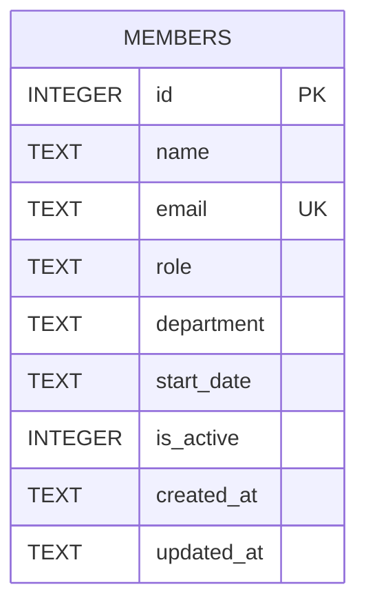

- One table, defined inline via `CREATE TABLE IF NOT EXISTS` in `getDb()` (`server/src/db.ts:18-30`) — there is no migrations directory or framework. Changing the schema means hand-editing this DDL string; existing `data/team.db` files on disk won't pick up new columns (`IF NOT EXISTS` is a no-op once the table exists), so a real schema change needs either an `ALTER TABLE` added alongside it or deleting the dev DB file.
- `is_active` exists as a soft-delete flag but nothing in `members.ts` ever sets it to `0` — `DELETE /api/members/:id` runs a real `DELETE FROM members WHERE id = ?` (`server/src/routes/members.ts:115`), a hard delete. The column is currently only read (`WHERE is_active = 1` in the list/stats queries), never written.
- `department` is a free-text `TEXT` column with no enum/lookup table or CHECK constraint, even though the UI and `/stats` endpoint treat it as a fixed set of categories. See [[gotchas]] for the resulting data-quality issue in the seed data and the related intentionally-red test.
- Seed rows are inserted once, guarded by a `COUNT(*) === 0` check (`server/src/db.ts:32-45`) — reseeding requires deleting `data/team.db` or setting `TEAMBOARD_DB_PATH` to a fresh path.
