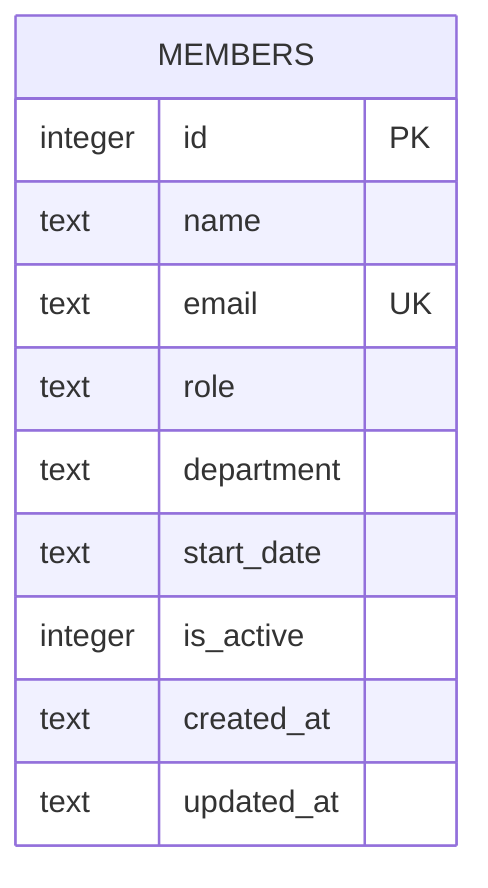

Single-table schema, created inline in `getDb()` (no migration files) —
server/src/db.ts:18-30.

- `email` has a `UNIQUE` constraint; `POST /api/members` relies on this and
  translates the SQLite `UNIQUE` error into a 409
  (server/src/routes/members.ts:39-44) rather than pre-checking.
- `is_active` defaults to `1` and is never written to `0` anywhere in the
  codebase — see [[overview]] for why that makes it effectively dead
  weight today.
- `created_at`/`updated_at` are `TEXT` timestamps from SQLite's
  `datetime('now')`; `updated_at` is the only one refreshed on write, by the
  `PATCH` handler (server/src/routes/members.ts:99).
