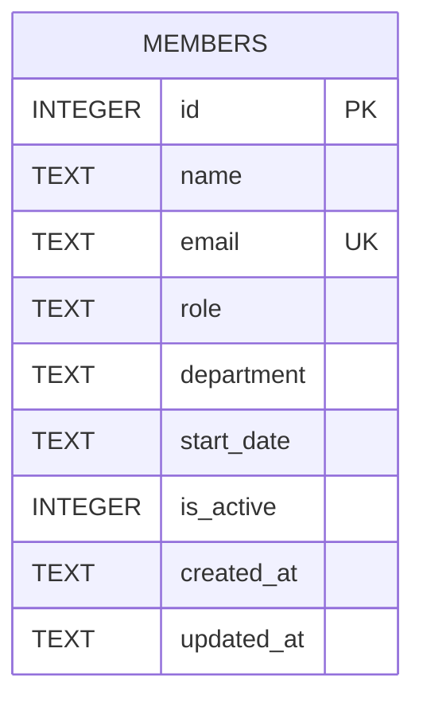

One table, created inline in `getDb()` (server/src/db.ts:18-30) — there is no separate migrations folder or ORM. `email` has a `UNIQUE` constraint that `POST /api/members` surfaces as a 409 (server/src/routes/members.ts:39-43). `is_active` defaults to 1 and is what `GET /api/members` filters on, but see ../gotchas.md — `DELETE` does not use this flag.
