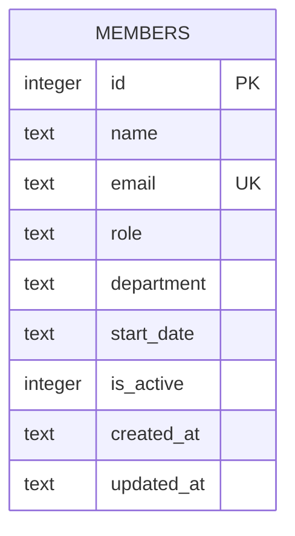

Single-table schema, created and seeded in `server/src/db.ts:11` (`CREATE TABLE IF NOT EXISTS members`, seeded with 8 rows when empty). No migrations directory — schema changes are made by editing the inline `CREATE TABLE` statement directly.

`is_active` implies a soft-delete design (`GET /api/members` filters `WHERE is_active = 1`), but `DELETE /api/members/:id` (`server/src/routes/members.ts:106`) issues a hard `DELETE FROM members WHERE id = ?` — it never sets `is_active = 0`. There is no code path that ever writes `is_active = 0`; the column is effectively dead for its apparent purpose. Treat this as a known gap, not a bug to silently "fix" in an unrelated change — see [[gotchas]].
