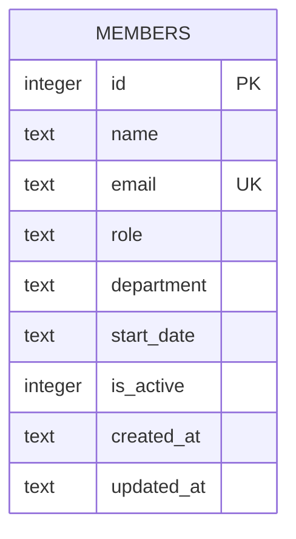

Single-table schema, created inline in `getDb()` (no migration files):

## `is_active` exists but nothing ever sets it to 0

The column defaults to `1` and `GET /api/members` filters on `is_active = 1` (`server/src/routes/members.ts:18-24`), which reads like a soft-delete design. But `DELETE /api/members/:id` (`server/src/routes/members.ts:106-117`) does a hard `DELETE FROM members`, not an `UPDATE ... SET is_active = 0`. No code path ever flips `is_active` to `0`. Treat `is_active` as effectively dead/always-1 unless you're the one wiring up soft delete.

## Seed data already violates a strict department enum

`getDb()`'s seed rows (`server/src/db.ts:37-44`) use **both** `'Engineering'` (Alice Chen) and `'Eng'` (David Kim, Hiro Tanaka) for what's meant to be the same department. Anyone implementing department validation (see `../gotchas.md`) needs a canonical department list that either normalizes or excludes the seed data's `'Eng'` rows — a naive fixed enum will break the existing seeded rows on `PATCH`.
