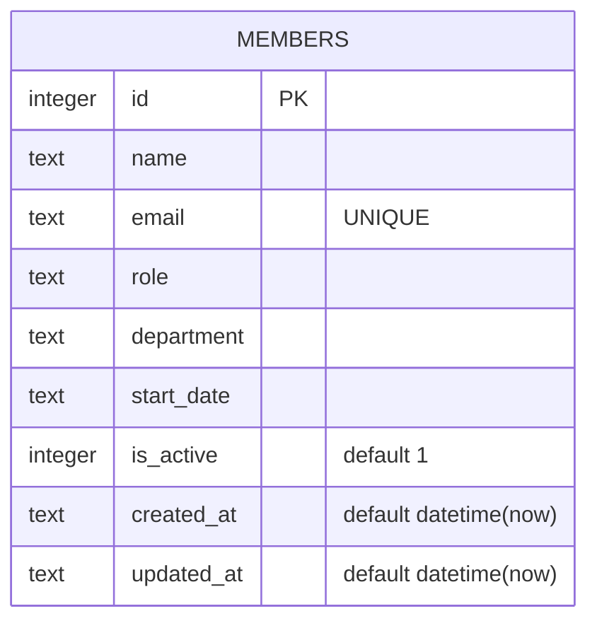

Single-table schema, created inline in `getDb()` (`server/src/db.ts:18-30`) — there is no migrations directory or ORM.

`is_active` looks like a soft-delete flag (`GET /api/members` filters `WHERE is_active = 1`), but nothing ever sets it to `0` — `DELETE /api/members/:id` (`server/src/routes/members.ts:106-117`) issues a real `DELETE FROM members`, permanently removing the row. See [[gotchas]] before adding a "restore deleted member" feature — the column exists but the deactivate path doesn't.
