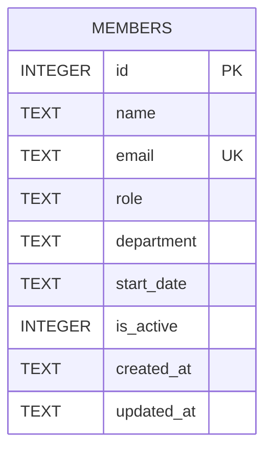

Single table, no foreign keys, no separate `departments`/`roles` tables — `department` and `role` are free-text columns on `members`, not enums or lookups (server/src/db.ts:19-29). The schema is created inline via `CREATE TABLE IF NOT EXISTS` in `getDb()`; there is no migrations directory or migration tool. Seed data (same file, run once when the table is empty) itself uses inconsistent department spellings — `'Engineering'` for one member and `'Eng'` for two others (server/src/db.ts:40,44) — so any department validation/normalization work must decide how to reconcile existing rows, not just gate new ones.
