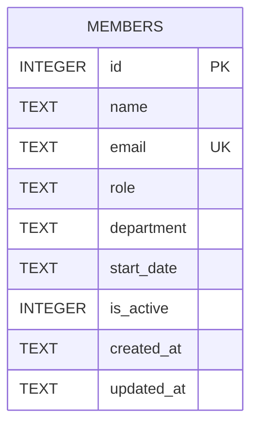

There is exactly one table, created inline in `getDb()` (`server/src/db.ts:18-30`) —
no migration files or ORM. `email` has a `UNIQUE` constraint; `members.ts:39-43`
relies on the SQLite `UNIQUE` error message text (`"UNIQUE"` substring match) to
turn a duplicate-email insert into a 409 rather than a 500. If the SQLite error
message format ever changes, that check silently stops matching.

`is_active` is a soft-delete style flag, but `DELETE /api/members/:id`
(`members.ts:106-117`) does a hard `DELETE FROM members`, not a flip to
`is_active = 0` — there's no way to "deactivate" a member through the current API,
despite `is_active` existing as a column and `GET /api/members` filtering on it.
