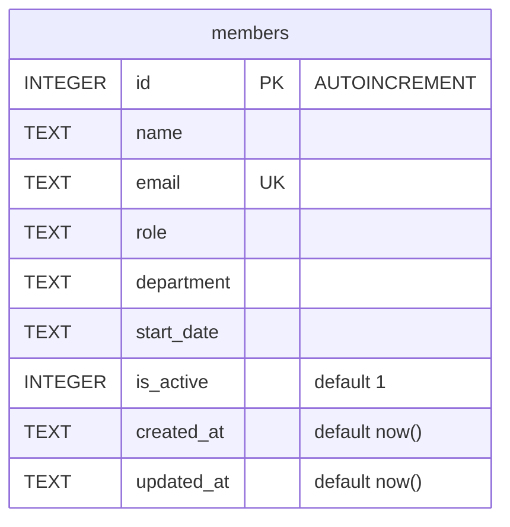

Single table, created inline in `getDb()` (`server/src/db.ts:18-30`) — there is no
migrations directory or schema file separate from this code.

## Gotchas specific to this schema

- `email` has a `UNIQUE` constraint but only `POST /` catches the resulting SQLite
  error and turns it into a 409 (`server/src/routes/members.ts:39-44`). `PATCH /:id`
  runs the same kind of `UPDATE ... SET email = ...` without a try/catch
  (`server/src/routes/members.ts:93-101`) — PATCHing a member's email to one that's
  already taken throws inside the handler and falls through to Express's default
  error handler (500), not a clean 409.
- `is_active` exists and is used to filter `GET /` (`members.ts:21`), but nothing in
  the API ever sets it to 0 — `DELETE /:id` does a hard `DELETE FROM members`
  (`members.ts:115`), and `PATCH /:id` only touches `name`/`email`/`role`/`department`
  (`members.ts:92`). There is currently no soft-delete path despite the column.
- Seed data uses inconsistent department names for Engineering — `'Engineering'` for
  Alice Chen vs `'Eng'` for David Kim and Hiro Tanaka (`server/src/db.ts:37,40,44`).
  `GET /api/members/stats`'s `GROUP BY department` (`members.ts:66`) will report these
  as two separate departments.
