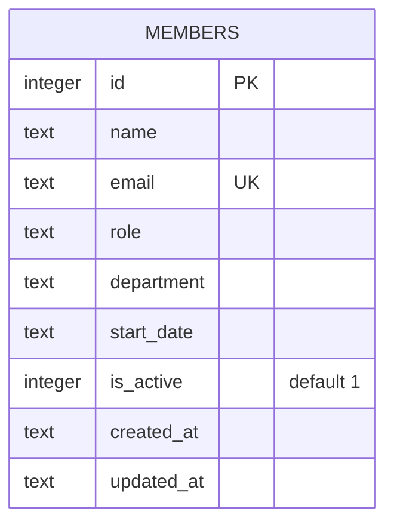

Single-table schema, created inline in `getDb()` (`server/src/db.ts`) — no
migration files or ORM. `email` has a `UNIQUE` constraint enforced at the DB
level; `members.ts` catches the resulting SQLite error message
(`err.message.includes('UNIQUE')`) to return 409 rather than checking
beforehand.

`department` and `role` are plain `TEXT` with no `CHECK` constraint, enum, or
foreign key — any string is accepted at the schema level. See [[gotchas]] for
why this matters for department validation work.
