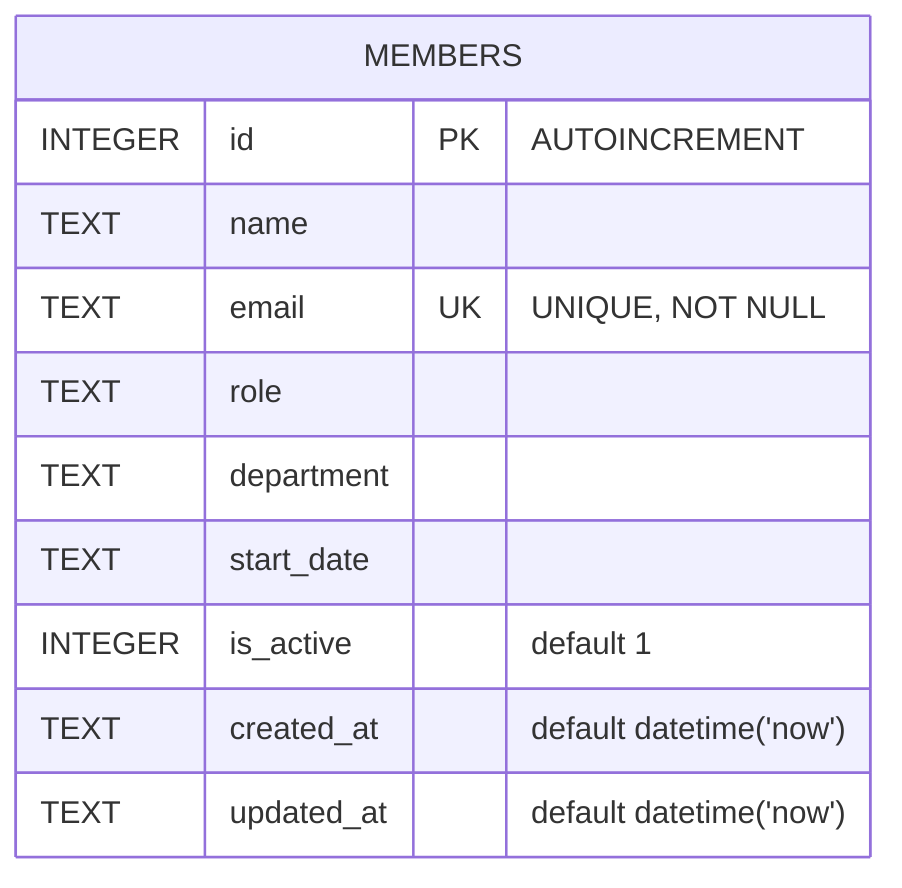

Single-table schema, created with `CREATE TABLE IF NOT EXISTS` on first `getDb()`
call (`server/src/db.ts:18`). No migrations directory or migration tool exists —
schema changes mean editing this `CREATE TABLE` string directly, and existing
`data/team.db` files on disk won't pick up new columns since the guard is
`IF NOT EXISTS`.

`department` and `role` are free-text `TEXT` columns with no `CHECK` constraint
or foreign key to a lookup table — see [[gotchas]] for why that matters for
validation and stats.

Seed data (8 rows, inserted only when the table is empty) is hardcoded in the
same function, not in a fixture file.
