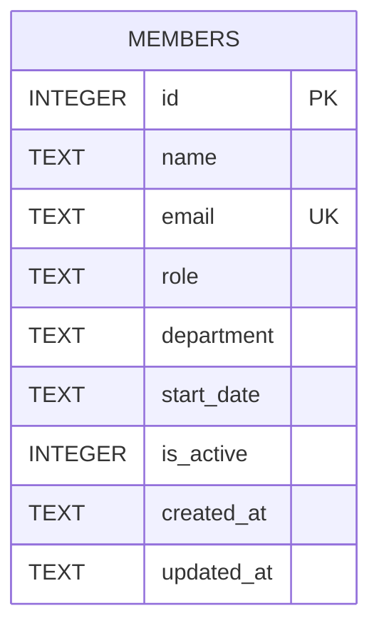

Single table, no foreign keys, created inline in `getDb()` (`server/src/db.ts:18-30`) rather than via a migration file — there is no migrations directory in this repo.

- `email` has a `UNIQUE` constraint enforced at the DB level; violating it surfaces as a generic `Error` that `members.ts` matches by substring (see [[backend-patterns]]).
- `department` is a free-text column with no `CHECK` constraint or reference table, despite the UI presenting it as a fixed field — see [[gotchas]].
- `is_active` defaults to `1` and is never set to `0` anywhere in the codebase today (`DELETE` removes rows outright) — see [[gotchas]].
