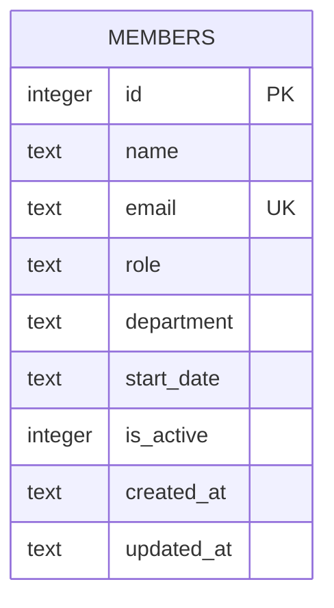

One table, created with `CREATE TABLE IF NOT EXISTS` on first `getDb()` call
— there are no migration files; schema changes mean editing the SQL string in
`server/src/db.ts` directly, and existing `data/team.db` files won't pick up
column changes (the `IF NOT EXISTS` guard skips re-running DDL on an
existing file).

- `email` has a `UNIQUE` constraint; `members.ts`'s `POST` handler catches the
  resulting SQLite error by string-matching `err.message.includes('UNIQUE')`
  and turns it into a 409 — any other constraint violation would re-throw as
  an unhandled 500.
- `is_active` is `INTEGER` (0/1), not a real boolean — `GET /` filters
  `WHERE is_active = 1`, but there is no route that sets it to 0 or 1
  (`DELETE` hard-deletes the row instead of soft-deleting it).
- `department` has no `CHECK` constraint or enum — any string is accepted at
  the DB layer. See [gotchas.md](gotchas.md) for the validation gap this
  causes at the API layer.
