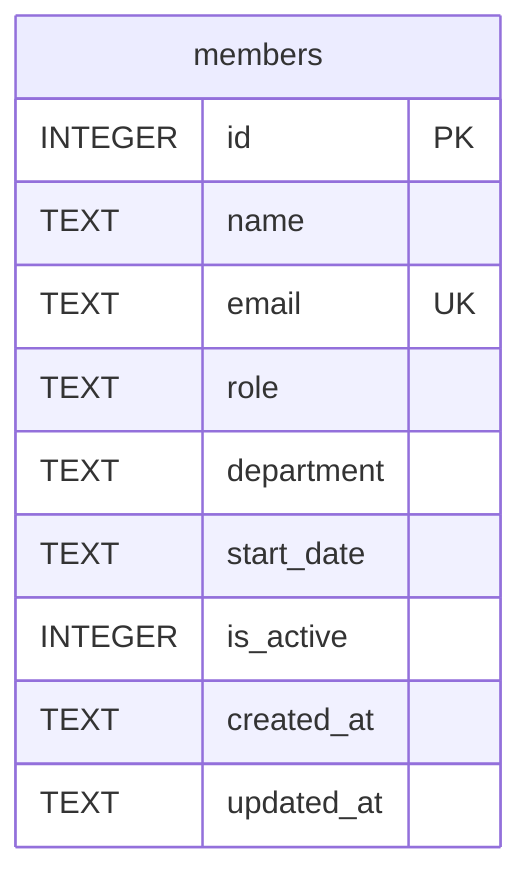

Single table, created inline in `getDb()` (`server/src/db.ts:18-30`) — there is
no migration framework or separate schema file.

- `email` has a `UNIQUE` constraint; `POST /api/members` catches the resulting
  SQLite error by matching `err.message.includes('UNIQUE')` and returns 409
  (`server/src/routes/members.ts:39-44`) — there's no pre-check query, so any
  other constraint violation would fall through and throw unhandled.
- `department` is still a free-text column with no `CHECK` constraint or SQL
  enum — but it is no longer unconstrained in practice. `server/src/routes/members.ts`
  validates it against the canonical code list in `server/src/departments.ts`
  on create/update, so only values in that lookup table can be written; see
  [[gotchas]] for how that list is duplicated on the client.
- Seed rows (`server/src/db.ts:37-44`) only insert once, guarded by
  `COUNT(*) = 0`, so schema/seed changes to `getDb()` won't apply to an
  existing `data/team.db` file — delete it to re-seed locally.
