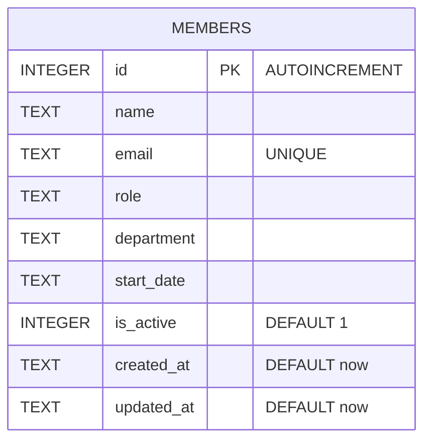

Single table, no foreign keys (`server/src/db.ts:18-30`). `email` has a `UNIQUE` constraint — `POST /api/members` catches the resulting SQLite error by matching `err.message.includes('UNIQUE')` and returns 409 (`server/src/routes/members.ts:39-43`); it isn't checked ahead of the insert.

`department` is a free-text column with no enum/check constraint at the DB level — see the known-red validation test noted in [[overview]].
