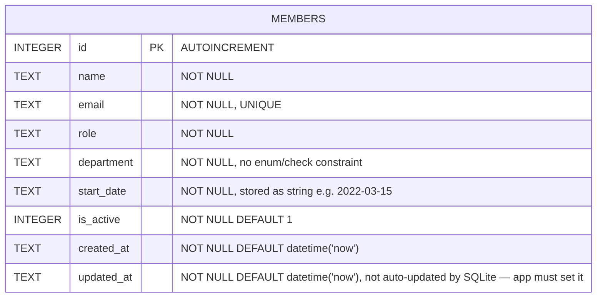

Single-table schema, created via `CREATE TABLE IF NOT EXISTS` in `getDb()`:

Notes derived from the code (not stated in CLAUDE.md/README):

- `department` has no `CHECK` constraint or foreign key to a departments table — it's a free-text column. This is why `POST /api/members` currently accepts any string (see `[[overview]]` for the TM-105 gap).
- `updated_at`'s default only fires on `INSERT`; the `PATCH` handler in `members.ts` explicitly sets `updated_at = datetime('now')` in its `UPDATE` statement — if any future write path forgets this, `updated_at` will go stale silently (SQLite won't update it automatically).
- `email` is the only unique constraint; `POST` relies on catching the SQLite `UNIQUE` constraint violation by string-matching `err.message.includes('UNIQUE')` (see `members.ts` POST handler) rather than a pre-check query.
