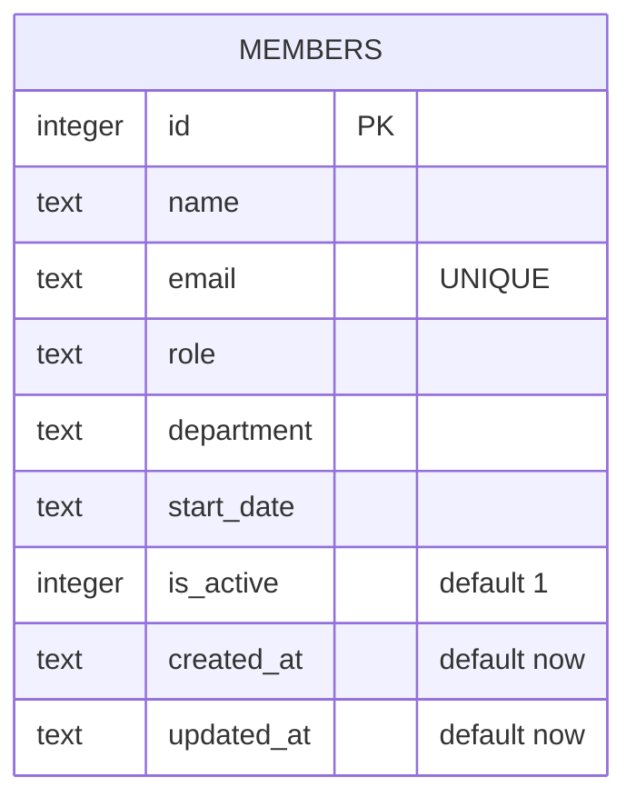

Single-table schema, created inline in `getDb()` (`server/src/db.ts:18-30`) — no migration files, no ORM, no foreign keys. `email` is the only uniqueness constraint; `department` is a free-text column with no allow-list (see [[overview]]).
