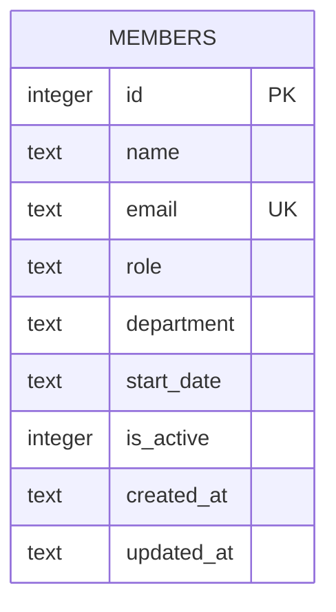

Single-table schema, created inline in `getDb()` (no migration files or ORM):

- `email` has a `UNIQUE` constraint; `POST /api/members` catches the resulting
  SQLite error and turns it into a 409 (`members.ts` — matches on
  `err.message.includes('UNIQUE')`, so any UNIQUE-constraint violation on this
  table maps to that same "email already exists" message).
- `department` is a free-text column with **no allowlist or enum anywhere in
  the code** — see [[gotchas]] for why this matters (TM-105) and for the
  inconsistent seed values (`Engineering` vs `Eng`).
- `is_active` exists but `DELETE /api/members/:id` performs a hard
  `DELETE FROM members`, not a soft-delete via `is_active = 0` — see
  [[gotchas]].
